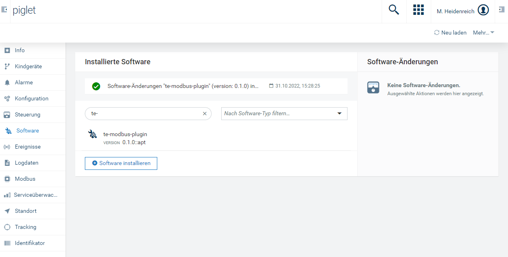
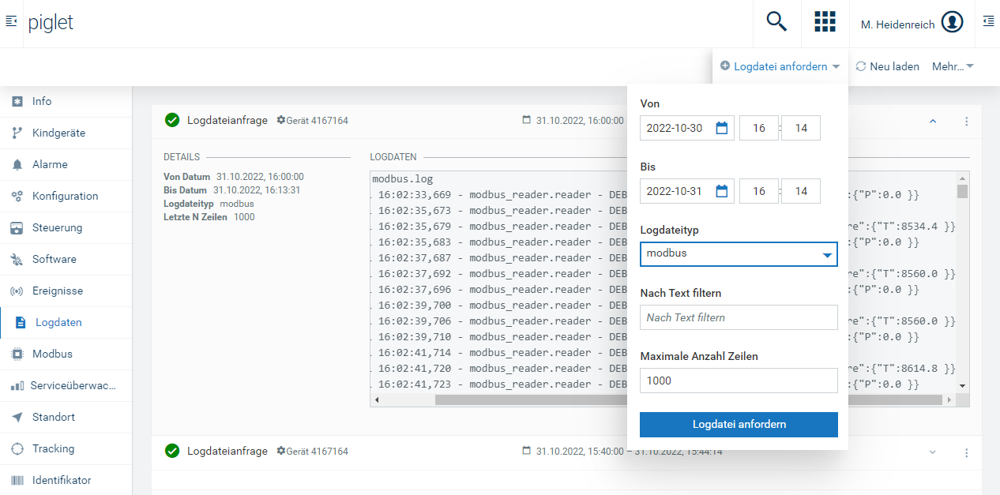
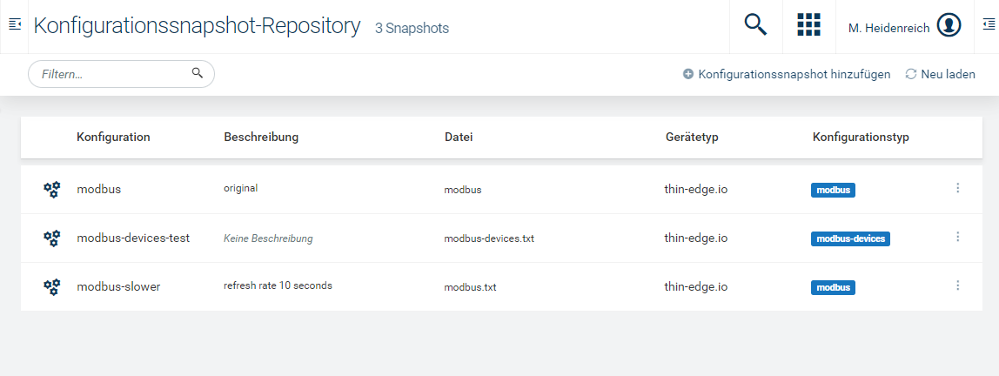
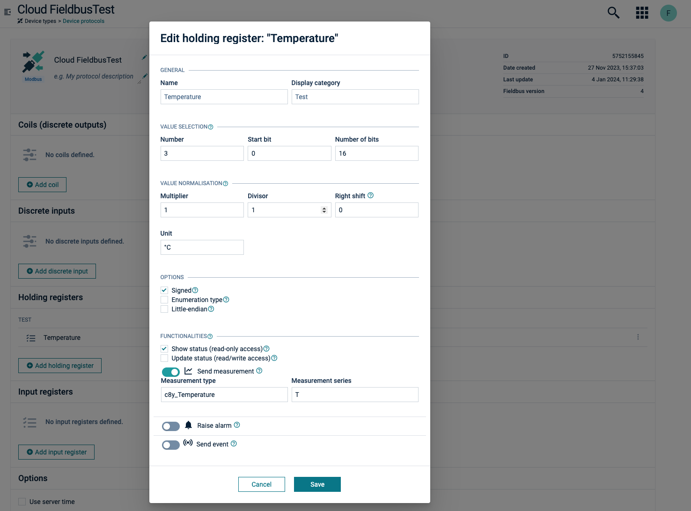

# modbus-plugin

Thin-edge.io modbus community plugin.
Plugin for polling Modbus devices and publishing the data to thin-edge.io. If used with Cumulocity IoT, the plugin can be managed via software configuration management. The Plugin also supports some of the [cloud fieldbus](https://cumulocity.com/guides/protocol-integration/cloud-fieldbus/) operations to set the modbus mapping via Cumulocity IoT UI.

## Table of contents

- [Overview](#overview)
- [Requirements](#requirements)
- [Demo](#demo)
- [Config files](#config-files)
  - [modbus.toml](#modbustoml)
  - [devices.toml](#devicestoml)
  - [Updating the config files](#updating-the-config-files)
- [Logs and systemd service](#logs-and-systemd-service)
- [Cumulocity Integration](#cumulocity-integration)

  - [Installation via Software Management](#installation-via-software-management)
  - [Log file access](#log-file-access)
  - [Config management](#config-management)
  - [Cloud Fieldbus](#cloud-fieldbus)

- [Testing](#testing)
- [Build](#build)
  - [Debian package](#debian-package)
- [Deployment](#deployment)
  - [As Python script (for dev only)](#as-python-script-for-dev-only)
  - [As deb file](#as-deb-file)

## Overview

The plugin regularly polls Modbus devices and publishes the data to the thin-edge.io broker. The plugin is based on the [pymodbus](https://pymodbus.readthedocs.io/en/latest/) library. After installing, the plugin can be configured by changing the modbus.toml and devices.toml files. The plugin comes with an example config [4] with comments to get you started. Adding multiple servers should also be as simple as adding additional [[device]] sections for each IP address you want to poll.

## Requirements

- Ubuntu >= 22.04 or Debian >= 11.0
- Python >= 3.8
- systemd
- for operations support: thin-edge.io >= 0.13.0
- for demo purposes: docker-compose

## Demo

You can run the thin-edge.io with the plugin and a modbus simulator locally via Docker containers. To start the demo, run 'just up' in the root folder of the repository. This will start the tedge container and the modbus simulator.
The modbus simulator runs a modbus server with some example registers. The simulator is based on the [pymodbus](https://pymodbus.readthedocs.io/en/latest/) library and can be found and changed in the [images/simulator](./images/simulator/) folder.

The demo includes a example device that maps an integer and float register to a Child Device. The device config can be found in the [images/tedge/config](./images/tedge/config) folder.

To start the containers, you need to have docker-compose installed. You can start the containers with:

    just up

After starting the containers, you need to register the thin-edge.io on your tenant. You can do this by running the following command:

    just bootstrap

This will create a device certificate in the tedge container and upload it to your tenant. To skip the manual input of your credentials, you create a .env file in your working directory:

    C8Y_BASEURL=https://<tenant>.cumulocity.com
    C8Y_USER=<user>
    C8Y_PASSWORD=<password>
    DEVICE_ID=<External ID of your Test Device>

You can skip the manual bootstrap process by running:

    just bootstrap --no-prompt

## Config files

There are two configuration files you need to edit for your use case. Any changes to the files will restart the polling of the Modbus servers automatically, so you don’t have to worry about restarting any services.
All config files are expected to be in the /etc/tedge/plugins/modbus folder.
As an alternative the directory can be based with -c or --configdir to the python script like so:

`python modbus_reader/reader.py --configdir <configfolder>`

If used with Cumulocity IoT, the plugins can be managed via the Device Management or created with the cloud fieldbus operations.

### modbus.toml

This includes the basic configuration for the plugin such as poll rate and the connection to thin-edge (the MQTT broker needs to match the one of tedge and is probably the default localhost:1883).

- poll rate
- connection to thin-edge (MQTT broker needs to match the one of tedge)

### devices.toml

This file includes the information for the connection(s) to the Modbus server(s) and how the Modbus Registers and Coils map to thin-edge’s Measurements, Events and Alarms.

The device config can be managed via Cumulocity IoT or created with the cloud fieldbus operations.

### Updating the config files

A watchdog observer will take care of restarting the MQTT and Modbus connection when either
devices.toml or modbus.toml changes. So there should be no need to manually restart the
python script / service.

## Logs and systemd service

Running the deb installer will place the config files into /etc/tedege/plugins/modbus/.
If systemd is installed, it will run the service as part of the post-installation routine.

Check the status of the systemd service with `sudo systemctl status te-modbus-plugin.service`
When running as a service, the default log output goes to /var/log/te-modbus-plugin/modbus.log.

## Cumulocity Integration

### Installation via Software Management

You can use the Software Repository of Cumulocity IoT and thin-edge.io Software Management plugin to install the deb remotely:
Upload the deb package to the Cumulocity Software Repository. The name **must** be te-modbus-plugin\_ and
the version **must** match the version in the \*.deb package name (e.g. 1.0.0). The rest of the fields can be set as necessary.
Go to the Software tab of the target device and select the package for installation. After the operation is successful the plugin will start automatically on the device.

### Log file access

For integration with the Cumulocity IoT log plugin add the following line to the /etc/tedge/c8y/c8y-log-plugin.toml

    { type = "modbus", path = "/var/log/te-modbus-plugin/modbus.log" }

### Config management

Both config files can either be updated in-place (i.e. simply editing with an editor) or
by using the c8y-configuration plugin. Add the following lines to the c8y-configuration-plugin.toml
to be able to access them from the Cumulocity Configuration UI:

    {path = '/etc/tedge/plugins/modbus/modbus.toml', type='modbus'},
    {path = '/etc/tedge/plugins/modbus/devices.toml', type='modbus-devices'}

To replace the files with a version from the Cumulocity Configuration Repository you have to download a copy,
edit it and upload it to the repository. The device type **must** be set to _thin-edge.io_ and the config type must match
the definition in your c8y-configuration-plugin.toml. I.e either _modbus_ (for modbus.toml) or _modbus-devices_ for (devices.toml)

### Cloud Fieldbus

The plugin supports the [cloud fieldbus](https://cumulocity.com/guides/protocol-integration/cloud-fieldbus/) operations to set the modbus mapping via Cumulocity IoT UI.
As of now, the plugin only supports the following operations:

- c8y_ModbusDevice
- Mapping of registers to Measurements with c8y_ModbusConfiguration

To create a Cloud Fieldbus Device in Cumulocity IoT, you need first to create a Modbus protocol. Open the Device protocols page in your Device Management and add a new Modbus protocol.
The configuration of your protocol depends on your Modbus Server. If you are using the Modbus Demo simulator, the you can use the following configuration:

After creating the protocol, you can add a new Cloud Fieldbus Device. Select the Modubs Tab on your thin-edge.io and add a new tcp device. If you are using the Modbus Demo simulator, you need to add the IP-Address of your Docker host, as Hostnames are not supported by the UI.

## Testing

To run the tests locally, you need to provide your Cumulocity credentials as environment variables in a .env file:

    C8Y_BASEURL=https://<tenant>.cumulocity.com
    C8Y_USER=<user>
    C8Y_PASSWORD=<password>
    DEVICE_ID=<External ID of your Test Device>

If you have the simulator and the tedge container running, you can run the tests with:

      just venv
      just setup
      just test

## Build

A package of the plugin, including the Modbus polling service and the Cloud Fieldbus operations, can be build with nfpm. To build the packages locally, make sure to install nfpm first.
The package requires a python3 installation on your device. The postinstallation script will create a virtualenv and install all dependencies. The virtualenv will be located in /etc/tedge/plugins/modbus The service will be started automatically after installation.

To create the packages, you need to install nfpm first:

[Install nfpm](https://nfpm.goreleaser.com/install/)

### Debian package

After installing, you can build the Debian package with:

     nfpm pkg --packager deb --target /tmp/

## Deployment

### As Python script (for dev only)

- copy modbus-plugin folder to target device
- ssh into device and go to the plugin folder
- create the virtualenv with `python -m venv venv`
- activate venv environment with `source ./venv/bin/activate`
- install all dependencies with `python -m pip install -r requirements.txt`
- run the reader with `python modbus_reader/reader.py -c ./config`

### As deb file

Run `sudo dpkg -i te-modbus-plugin-<version>-<arch>.deb`
